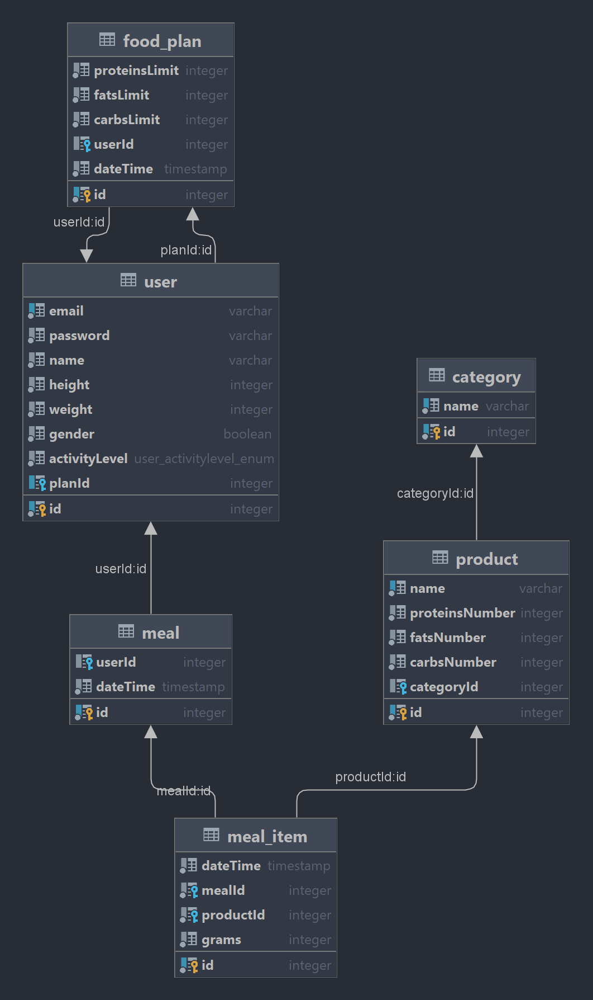

# Подшивалов О. И. M33061

Приложение для учета приемов пищи с калькулятором БЖУ

__Figma__:  
https://www.figma.com/file/QAwCMx3WIyVQ0mx33ZQBdB/wellcal-project-web?node-id=0%3A1

### Entities:
1. __User__ -- пользователь зарегистрировавшийся в приложении и имеющий данные о росте, весе, возрасте, поле и уровне активности.
2. __Product__ -- продукт(огурец, голень курицы, борщ), который описывается названием и БЖУ.
3. __Category__ -- категория продуктов.
4. __Meal__ -- прием пищи, который состоит из 1.\.* `MealItem`.
5. __MealItem__ -- продукт, добавленный в один из приемов пищи `Meal`, отличается тем, что имеет свой вес в граммах.
6. __Plan__ -- персональный план дневного БЖУ, ассоциированный с одним `User`.

